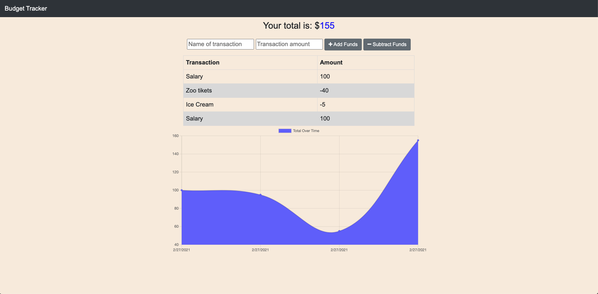

# Online/Offline Budget Tracker 

## Table Of Contents

1. [License](#license)

2. [Description](#description)

3. [Usage](#usage)

4. [Contribution](#Contribution)

5. [Questions](#questions)

## Description

[Deployed Link](https://pd-budget-tracker.herokuapp.com/)

Budget Tracker is a Progressive Web Application that can be extracted from the browser; then, it can function as any native apps on the Phone or Desktop. Also, Budget Tracker saves transactions even if it's offline, and the transactions gets synchronized with the database when the app is back online.

## Usage

The usage of the app is straight forward. In the text fields you need to enter transaction name and amount; then, by pushing "Add Funds" or "Subtract Funds" buttons, you respectively add or subtract money. The result of your balance is displayed on the top, and all the transactions are displayed right under the text fields. Finally, to see the visual representation of your financial changes, look at the bottom half of the screen where is displayed the financial diagram.

To export the app as native on your phone or desktop follow these steps.

1. On the right side of your search nav bar should be an export icon, so just push on it.  
   
2. Go to your device app menu and look for the app name.
3. Use the app.

## Contribution

I am open to any collaborations. Let me know on the email bellow.

## Questions

My GitHub profile: [https://github.com/paveldarii](https://github.com/paveldarii).

My email address: paveldarii@yahoo.com

## License

[The MIT License](https://opensource.org/licenses/MIT/)
